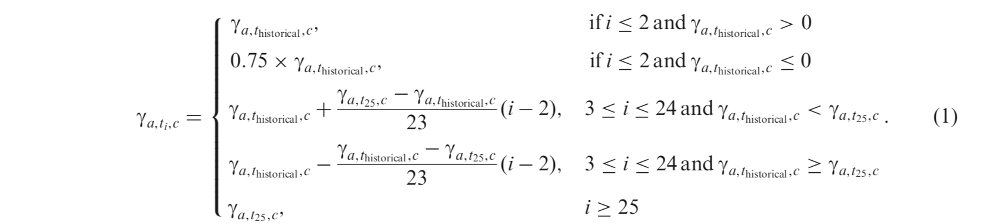

```{r xaringan-themer, include = FALSE}
library(xaringanthemer)
mono_dark(base_color = "#cbf7ed",
  header_font_google = google_font("Josefin Sans"),
  text_font_google   = google_font("Montserrat", "300", "300i"),
  code_font_google   = google_font("Droid Mono")
)
```

```{r setup, include=FALSE}
options(htmltools.dir.version = FALSE)
```
# What does the Social Security Administration do?
- Provide benefits to over 58 million retirees by taxing 210 million workers. 
<br/> <br/>
- Taxes come from the current workers and go directly to current retirees.
<br/> <br/>
- So, when congress considers SS policy, they need to have a good grasp of what the balance of our "trust funds," essentially the tax revenue yet to be paid out, is going to look like.

---
class: center, middle

```{r echo = FALSE, warning = FALSE}
library(knitr)
include_graphics("figures/systematic/graphics-observed-bw-1.pdf")
```

---
# The Problem
- As we will see, SSA projections of mortality and, more importantly, the overall health of the trust funds, are biased.
<br/> <br/>
- As a result, efficient policy is hampered by a lack of clarity and honesty regarding the future of SS balances. 
<br/> <br/>
- To make things worse, the SSA has a cryptic methodology with which they develop their forecasts.
  - This not only creates bias, but makes it impossible for improvements to be made.
  - Especially problematic when policy is based near exclusively on the SSA's reports. 

---
# The Data
- Forecasts
  - Mortality rate / life expectancy projections from the SSA.
  - Fertility rate projections from the SSA.
  - Expenditure, Fund Balance, and Fund Ratio projections from the SSA.
- Observed values
  - Mortality rates / life expectancies from the SSA and Human Mortality Database.
  - Fertility rates from the SSA and Human Fertility Database.
  - Expenditures, Fund Balances, and Fund Ratios from the SSA.
  - Policy proposal scorings from congress.
  - UROD (ultimate rate of decline) values from Trustees' Reports and Technical Advisory Reports.

---
class: center, middle, inverse
# What's Wrong?
Our forecasts are systematically innacurate.

---
class: center, middle

```{r echo = FALSE, warning = FALSE}
include_graphics("figures/systematic/graphics-2010-resid-by-tr-bw-1.pdf")
```

---
class: center, middle

```{r echo = FALSE, warning = FALSE}
include_graphics("figures/systematic/graphics-balance_resid_lattice-bw-1.pdf")
```

---
class: center, middle

```{r echo = FALSE, warning = FALSE}
include_graphics("figures/systematic/graphics-cost_resid_lattice-bw-1.pdf")
```

---
class: center, middle

```{r echo = FALSE, warning = FALSE}
include_graphics("figures/systematic/graphics-ci-coverage-bw-1.pdf")
```

---
class: center, middle, inverse
# Why?
It's a hard problem. And the SSA appears to be handling it wrong.

---
class: center, middle

```{r echo = FALSE, warning = FALSE}
include_graphics("figures/explaining/graphics-hmd-qx-time-1.pdf")
```

---
# What they are doing
- Use 210 separate subjectively chosen UROD's to create their ultimate forecasts.
- Then, combine all of these UROD's together and review them. 
```{r echo = FALSE, warning = FALSE}

```
- "Finally, SSA evaluates the quality of its overall forecast of total mortality well into the future. For example, if the age profile of the forecast in the year 2100 is not smooth or does not follow the ubiquitous shape of age profiles, SSA will readjust some of the UROD and reevaluate the quality of the updated total mortality forecast."
  - As one could imagine, some bias is introduced through this process.

---
# Why they are doing it
- Social-Psychological Pressures
  - "Although perhaps counter intuitive, Banaji and Greenwald (2013) and numerous others in the literature have shown that good intentions can coexist with a high probability of bias when human beings perform complex tasks with high levels of discretion over many individual decisions, little feedback on whether they made the right choice the last time, high levels of external pressure, and few external checks."
- Internal Pressures
  - Island of fairness
  - Monopoly supplier of evaluations and forecasts
  - Consistency bias
  - Ignoring technical panel methodological recommendations
  - Ignoring Technical Panel substantive recommendations
  - Informal procedures that increase vulnerability to bias
- External Pressures
  - Partisan motives and political strategy

---
class: center, middle, inverse
# What Does This Mean?
Our forecasts don't make sense.
---
class: center, middle

```{r echo = FALSE, warning = FALSE}
include_graphics("figures/explaining/graphics-mx-problems-1.pdf")
```

---
class: center, middle

```{r echo = FALSE, warning = FALSE}
include_graphics("figures/explaining/graphics-ex-shortrun-1.pdf")
```

---
class: center, middle, inverse
# And The Implications Are Significant.

---
class: center, middle

```{r echo = FALSE, warning = FALSE}
include_graphics("figures/explaining/graphics-proposals-1.pdf")
```

---
class: center, middle

```{r echo = FALSE, warning = FALSE}
include_graphics("figures/systematic/graphics-unanticip_costs-bw-1.pdf")
```

---
class: center, middle, inverse
# Can We Do Better?
Yes. We can.

---
class: center, middle

```{r echo = FALSE, warning = FALSE}
include_graphics("figures/explaining/graphics-urod_react-1.pdf")
```

---
class: center, middle, inverse
# Extension Concept

---
class: center, middle

```{r echo = FALSE, warning = FALSE}
include_graphics("figures/explaining/graphics-hmd-qx-age-1.pdf")
```

---
class: center, middle

```{r echo = FALSE, warning = FALSE}
include_graphics("figures/explaining/graphics-ageprofiles-1.pdf")
```

---
class: center, middle

```{r echo = FALSE, warning = FALSE}
include_graphics("figures/explaining/graphics-ratechange-1.pdf")
```

---
class: center, middle, inverse
# Questions & Comments (Especially Comments)